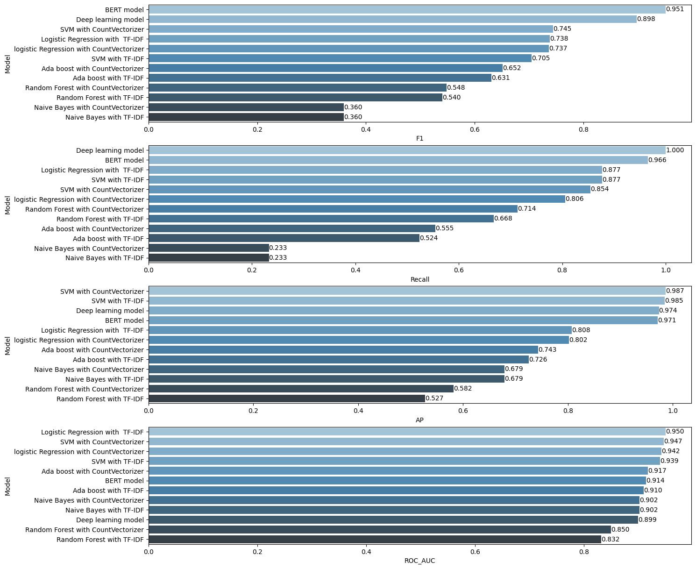

# NLP_Sentiment_Analysis_Project

Un this project, the analysis will focus on using Natural Language techniques to find broad trends in the written thoughts of the customers. 
  
The goal in this project is to predict whether customers recommend the product they purchased using the information in their review text.
  
One of the challenges in this project is to extract useful information from the *Review Text* variable using text mining techniques. The other challenge is the need to convert text files into numeric feature vectors to run machine learning algorithms.

At the end of this project, classification models using Machine Learning algorithms (<b>Logistic Regression, Naive Bayes, Support Vector Machine, Random Forest and Ada Boosting</b>), <b>Deep Learning algorithms</b> and <b>BERT algorithm</b> was built.

The data is a collection of 22641 Rows and 10 column variables. Each row includes a written comment as well as additional customer information.
Also each row corresponds to a customer review, and includes the variables.

## The features in the given dataset are:
- <b>Clothing ID:</b> Integer Categorical variable that refers to the specific piece being reviewed.
- <b>Age:</b> Positive Integer variable of the reviewers age.
- <b>Age:</b> Positive Integer variable of the reviewers age.
- <b>Title:</b> String variable for the title of the review.
- <b>Review Text:</b> String variable for the review body.
- <b>Rating:</b> Positive Ordinal Integer variable for the product score granted by the customer from 1 Worst, to 5 Best.
- <b>Recommended IND:</b> Binary variable stating where the customer recommends the product where 1 is recommended, 0 is not recommended.
- <b>Positive Feedback Count:</b> Positive Integer documenting the number of other customers who found this review positive.
- <b>Division Name:</b> Categorical name of the product high level division.
- <b>Department Name:</b> Categorical name of the product department name.
- <b>Class Name:</b> Categorical name of the product class name.

# Tasks: ⚙️

#### 1. Exploratory Data Analysis

- Import Modules, Load Discover the Data

#### 2. Feature Selection and Data Cleaning

- Feature Selection and Rename Column Name
- Missing Value Detection

#### 3. Text Mining

- Tokenization
- Noise Removal
- Lexicon Normalization

#### 4. WordCloud - Repetition of Words

- Detect Reviews
- Collect Words
- Create Word Cloud

#### 5. Sentiment Classification with Machine Learning, Deep Learning and BERT Model

- Train - Test Split
- Vectorization
- TF-IDF
- Logistic Regression
- Naive Bayes
- Support Vector Machine
- Random Forest
- AdaBoost
- Deep Learning Model
- BERT Model
- Model Comparison

## Used Libraries 📚
- `numpy`- `pandas`- `matplotlib`- `seaborn` - `sklearn`- `tensorflow` - `nltk` - `wordcloud` - `keras` - `scikitplot`- `transformers` 

  
## Run the project ⚙️
The repository includes a Jupyter notebook which you can run on your local machine or use this <a href=""> Google Colab </a> link.

## Results 🪄

In this project, sentiment analysis was employed to assess product recommendations. A variety of machine learning (ML) algorithms were utilized to enhance prediction accuracy, and a deep learning (DL) algorithm was incorporated for comparative analysis with traditional machine learning models.

Upon comparing the models, it is evident that the DL and BERT algorithm outperformed the ML algorithms, exhibiting higher F1-score, recall, and AP values.

## Acknowledgements
This project is part of ML bootcamp provided by <a href="https://clarusway.com/"> Clarusway</a>.

